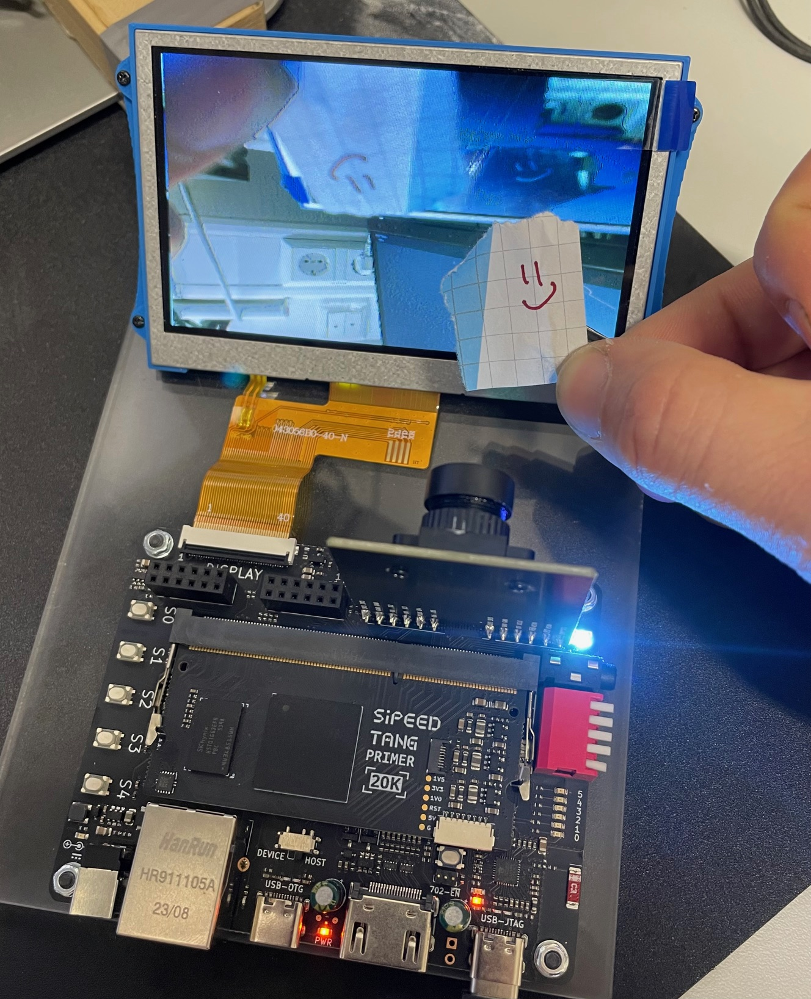

## TLDR
Physical constraint (fanout) file to use PMOD-DVP OV5640 in combination with Tang Nano Primer 20k and *Cam2lcd/OV5640_LCD480_FIFO* Demo code.  
## Intro
The [Sipeed Tang Primer 20k with Dock ](https://wiki.sipeed.com/hardware/en/tang/tang-primer-20k/primer-20k.html) has an camera connector but I experienced much heat emission on an OV5640 Camera module connected directly to it while running the [Cam2LCD Demo](https://github.com/sipeed/TangPrimer-20K-example/tree/main/Cam2lcd/OV5640_LCD480_FIFO)from Sipeeds Git on the Tang Primer. They get hot when longer in use. I killed at least one camera module by overheating it.

Sipeed has a PMOD compatible camera adapter called [PMOD-DVP](https://wiki.sipeed.com/hardware/en/tang/tang-PMOD/FPGA_PMOD.html), but at the point of writing this, no demo code available. The PCB itself uses its copper plating for heat dissipation, enough for that use case. Plus some power/level conversion circuitry, because the camera needs additional lower voltages different than 3.3V. (Todo: Which voltages,  more precise? I2C signal levels?). I may  reuse the module on other PMOD compatible boards, so thats fine!

## How to use? 
Just replace the [top.cst](./top.cst) file in the OV5640_LCD480_FIFO folder. There are some issues with the   OV5640_LCD480_DDR3 code, didnt figure out what goes wrong yet. 

